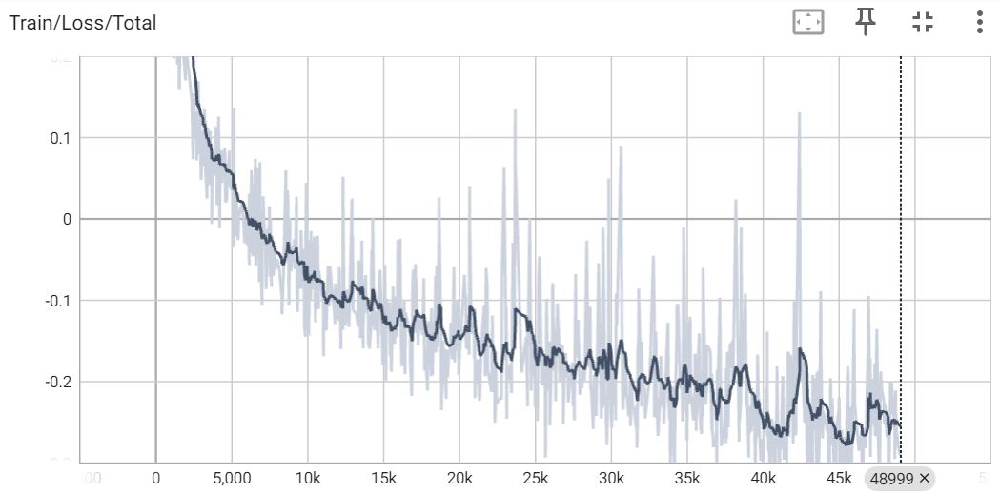
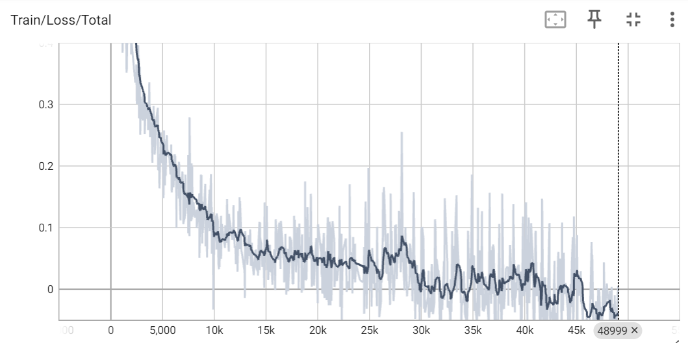

# Sketch-RNN

Deep learning model that trains on a dataset of human-drawn sketches of a subject (e.g. bicycle, cat, etc.) and then generates new sketches of that subject. 

## Overview

In this experiment, I implemented the Sketch-RNN model from scratch, based on Google Brain's [A Neural Representation of Sketch Drawings](https://arxiv.org/pdf/1704.03477) paper and after reviewing a previous implementation by [the LabML library](https://nn.labml.ai/sketch_rnn/index.html). I also used the data-processing pipeline from LabML.

Sketch-RNN is similar to a variational autoencoder (VAE). The encoder is a recurrent network that encodes a series of pen strokes into a distribution from which a latent vector is sampled. The decoder is another recurrent network that tries to reconstruct the input pen stroke sequence. The decoder's output is a series of Gaussian mixture distributions, from which actual pen strokes would be sampled. Please refer to my [computation graph below](#computation-graph) for a more granular visualization.

This model was trained on the [Quick, Draw!](https://github.com/googlecreativelab/quickdraw-dataset) dataset. Specific .npz files pertaining to specific object categories can be found [here](https://console.cloud.google.com/storage/browser/quickdraw_dataset/sketchrnn). Each sketch is a series of strokes, in which each stroke is represented by a tuple of several values, including $\Delta x$ and $\Delta y$ to represent the offset between current and next pen positions, as well as a flag to indicate whether the pen should touch the canvas or not.

As I explained [below](#demo), in my limited experiments so far, the model was able to draw coherent sketches quickly, but failed to encode and draw more sophisticated features. In upcoming experiments, I plan to increase the model's capacity to learn to draw more difficult features.

## Training

### Requirements
```
matplotlib==3.9.0
numpy==1.26.4
torch==2.3.0

```

### Script

```
python train_sketch_rnn.py --data_file=/path/to/npz/data/file --folder_path=/path/to/folder/to/be/created/for/training
```

Run `train_sketch_rnn.py` to train Sketch-RNN. Two arguments are required: (1) the path to the input data (.npz) file and (2) the path to the folder where module checkpoints, generated sketches and TensorBoard training stats will be saved.

During training, a live loss curve and training stats, including average gradient values for each layer, can be opened by running: ``` tensorboard --logdir /FOLDER_PATH/TENSORBOARD_FOLDER_NAME``` (see below for more details).


```
usage: train_sketch_rnn.py [-h] --data_file DATA_FILE --folder_path FOLDER_PATH [--lr LR] [--batch_size BATCH_SIZE]
                           [--encoder_lstm_hidden_size 64-2048] [--decoder_lstm_hidden_size 64-2048] [--d_z 64-1024]
                           [--num_Gaussians 1-127] [--weight_KL WEIGHT_KL] [--log_file_name LOG_FILE_NAME]
                           [--encoder_folder_name ENCODER_FOLDER_NAME] [--decoder_folder_name DECODER_FOLDER_NAME]
                           [--tensorboard_folder_name TENSORBOARD_FOLDER_NAME]
                           [--sampled_sketches_folder_name SAMPLED_SKETCHES_FOLDER_NAME] [--optimizer_func {adam,rmsprop}]
                           [--load_encoder_checkpoint_file LOAD_ENCODER_CHECKPOINT_FILE]
                           [--load_decoder_checkpoint_file LOAD_DECODER_CHECKPOINT_FILE]

Train a Sketch-RNN model.

options:
  -h, --help            show this help message and exit
  --data_file DATA_FILE
                        Path to the training data (.npz file).
  --folder_path FOLDER_PATH
                        Path to the folder for saving model checkpoints and logs.
  --lr LR               Learning rate for the optimizer (must be <= 2.0).
  --batch_size BATCH_SIZE
                        Batch size for training.
  --encoder_lstm_hidden_size 64-2048
                        Hidden size of the encoder LSTM (must be between 64 and 2048).
  --decoder_lstm_hidden_size 64-2048
                        Hidden size of the decoder LSTM (must be between 64 and 2048).
  --d_z 64-1024         Dimensionality of the latent space (must be between 64 and 1024).
  --num_Gaussians 1-127
                        Number of Gaussian mixtures in the decoder (must be between 1 and 127).
  --weight_KL WEIGHT_KL
                        Weight of the KL divergence loss term (must be <= 3.0).
  --log_file_name LOG_FILE_NAME
                        Name of the log file (automatically saved inside 'folder_path').
  --encoder_folder_name ENCODER_FOLDER_NAME
                        Folder name for saving encoder checkpoints (automatically saved inside 'folder_path').
  --decoder_folder_name DECODER_FOLDER_NAME
                        Folder name for saving decoder checkpoints (automatically saved inside 'folder_path').
  --tensorboard_folder_name TENSORBOARD_FOLDER_NAME
                        Folder name for TensorBoard logging (automatically saved inside 'folder_path').
  --sampled_sketches_folder_name SAMPLED_SKETCHES_FOLDER_NAME
                        Folder name to save sampled sketches (at the beginning of each batch - this folder is
                        automatically saved inside 'folder_path').
  --optimizer_func {adam,rmsprop}
                        Optimizer function (adam or rmsprop).
  --load_encoder_checkpoint_file LOAD_ENCODER_CHECKPOINT_FILE
                        Path to a pre-trained encoder checkpoint file (optional).
  --load_decoder_checkpoint_file LOAD_DECODER_CHECKPOINT_FILE
                        Path to a pre-trained decoder checkpoint file (optional).
```

## Demo

In this experiment, given the limited time and computing resources, I used the following hyperparameters (which are also default values for CLI args into `train_sketch_rnn.py`) to train a Sketch-RNN model on sketches of cats and bicycles (separately). Overall, the model could learn in just a few epochs to draw coherent sketches with clear main features of cats or bibycles. But the model did not improve much afterwards and was stuck with simplistic drawings.

Perhaps, the latent representation learning in the encoder was inadequate to learn enough variety of features, or the decoder did not have enough capacity to draw sophisticated sketches.

Google Brain's paper used larger values for LSTM hidden size, potentially giving the model more capacity to learn. My next experiments will be to increase the encoder and the decoder's capacity and to use larger version of the .npz data file to test the network's ability to learn and draw.

```
lr = 0.001
optimizer_func = 'adam'
batch_size = 100
encoder_lstm_hidden_size = 256
decoder_lstm_hidden_size = 512
d_z = 128
num_Gaussians = 20
weight_KL = 0.5
log_file_name = "training_log.txt"
encoder_folder_name = "saved_encoders"
decoder_folder_name = "saved_decoders"
tensorboard_folder_name = "tensorboard_logging"
```


### Training on "bicycle" sketches

Training loss curve (total) after certain number of batches:
<figure>
  
  
</figure>

<br />
<br />

<table>
  <tr>
    <td></td>
    <td></td>
    </tr>
    <tr></tr>
    <tr>
    <td></td>
    <td></td>
    </tr>
    <tr></tr>
  <tr>
    <td colspan="2" style="text-align: center;">At first, the model's generated bicycle sketches did not quite make sense.</td>
  </tr>
</table>

<table>
  <tr>
    <td></td>
    <td></td>
    </tr>
    <tr></tr>
    
  <tr>
    <td colspan="2" style="text-align: center;">But the model learned to draw a coherent bicycle after just 5 eopchs, attempting to draw the round wheels and connect them. It even tried to draw the spokes inside a wheel. </td>
  </tr>
</table>

<table>
  <tr>
    <td></td>
    <td></td>
    </tr>
    <tr></tr>
    <tr>
    <td></td>
    <td></td>
    </tr>
    <tr></tr>
  <tr>
    <td colspan="2" style="text-align: center;">After about 20 epochs, the sketches were neat and coherent, with clear main features such as two connected wheels, a seat and a handlebar.</td>
  </tr>
</table>

<table>
  <tr>
    <td></td>
    <td></td>
    </tr>
    <tr></tr>
    <tr>
    <td></td>
    <td></td>
    </tr>
    <tr></tr>
  <tr>
    <td colspan="2" style="text-align: center;">Unfortunately, the model stopped improving after that. Generated sketches remained quite simplistic relative to human-drawn sketches from the training data, where wheels sometimes have spokes.</td>
  </tr>
</table>


<table>
  <tr>
    <td></td>
    <td></td>
    </tr>
    <tr></tr>
    <tr>
    <td></td>
    <td></td>
    </tr>
    <tr></tr>
  <tr>
    <td colspan="2" style="text-align: center;">Here are some input training data for comparison. Perhaps, the latent representation learning in the encoder was inadequate to learn enough variety of features, or the decoder did not have enough capacity to draw sophisticated sketches.</td>
  </tr>
</table>

### Training on "cat" sketches

Training loss curve (total) after certain number of batches:
<figure>
  
  
</figure>

<br />
<br />

<table>
  <tr>
    <td></td>
    <td></td>
    </tr>
    <tr></tr>
    <tr>
    <td></td>
    <td></td>
    </tr>
    <tr></tr>
  <tr>
    <td colspan="2" style="text-align: center;">In the first few epochs, the model generated non-sensical sketches, but it seems to realize main features of a cat such as a round head and a pointed ear.</td>
  </tr>
</table>

<table>
  <tr>
    <td></td>
    <td></td>
  </tr>
    
  <tr></tr>

  <tr>
    <td colspan="2" style="text-align: center;">After about 10 epochs, the drawings still looked messy, but at least had a large face and two ears.</td>
  </tr>
</table>

<table>
  <tr>
    <td></td>
    <td></td>
    </tr>
    <tr></tr>
    <tr>
    <td></td>
    <td></td>
    </tr>
    <tr></tr>
  <tr>
    <td colspan="2" style="text-align: center;">After about 20 epochs, features such as eyes and whiskers start to appear more often.</td>
  </tr>
</table>

<table>
  <tr>
    <td></td>
    <td></td>
    </tr>
    <tr></tr>
    <tr>
    <td></td>
    <td></td>
    </tr>
    <tr></tr>
  <tr>
    <td colspan="2" style="text-align: center;">However, the model stopped improving after that. After 50 epochs, the eyes were still not very pronounced. Whiskers and nose were not consistently drawn.</td>
  </tr>
</table>


<table>
  <tr>
    <td></td>
    <td></td>
    </tr>
  <tr></tr>
  <tr>
    <td colspan="2" style="text-align: center;">At about 70 epochs, the model seemed to have learned the nose, but did not consistently draw it. Perhaps latent encoding/representation was lacking, or the decoder was inadequate in sketching enough variety of cat features.</td>
  </tr>
</table>


## Computation graph

For anyone who wants to look into the code, here's the [computation graph](<Computation Graph Sketch RNN.pdf>) that I outlined, along with variable name and tensor shape, to help guide myself in coding the modules in PyTorch.

